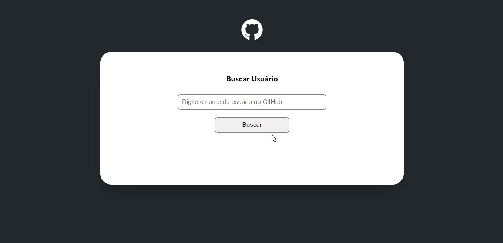
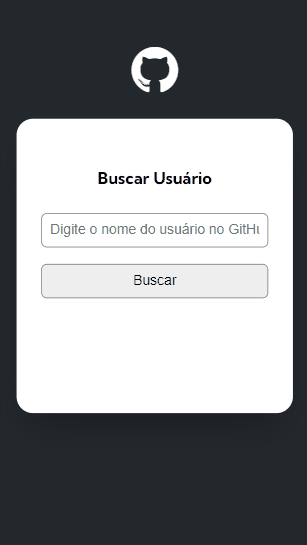

# 🕵️‍♀️ Projeto GitHub API - Desafio DevQuest JavaScript Avançado

Resposta ao desafio DevQuest do módulo JavaScript Avançado.

### 🎥 Gif da tela - Desktop Design

[]

### 🎥 Gif da tela - Mobile Design

[]

# 🚀 Proposta

Implementar novas solicitações ao projeto com uso da API do GitHub, quais:

- "Pegar" e mostrar em tela o número de seguidores e de pessoas que o usuário está seguindo;
- Acrescentar um campo com 10 eventos do usuário, tendo que "pegar" e mostrar em tela;
- Acrescentar campos extras na parte onde mostramos os portifólios do usuário, incluindo os campos: forks, estrelas, watchers e linguagem.

# 🔐 Desafios encontrados

- Conseguir filtrar e mostrar os eventos dos tipos: Push e Create;
- Encontrar a mensagem do evento.

# 🔨 Tecnologia usada

- HTML
- CSS
- JS
- Fetch API

# 🔗 Links

- Clique no link para acessar a página: https://osmarviana.github.io/projeto-inicial-fetch-github-api/

# 🧐 Autor

## Osmar Viana Torres

- Instagram: https://www.instagram.com/osmarvianatorres
- Github: https://github.com/osmarviana
- Linkedin: https://www.linkedin.com/in/osmarvianatorres/
